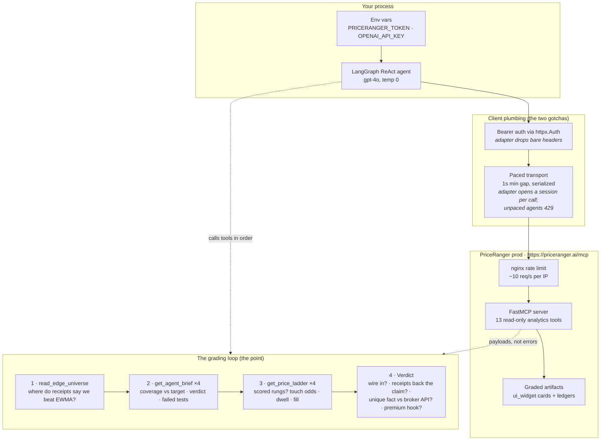

# PriceRanger MCP — Agent Value Check

An open example of how an agentic process qualifies the
[PriceRanger](https://priceranger.ai) MCP server: what it is, what it is not,
and how to grade it on evidence before wiring it into a trading agent.

**`priceranger_mcp_eval.py`** is the whole example. One file, no framework
beyond LangGraph's prebuilt ReAct agent.

## What the service is (and is not)

**Risk telemetry with receipts.** Per asset, per hour:

- A calibrated range band that publishes its **realized coverage against the
  90% it promises**, a verdict, and the list of calibration tests it failed.
- A price ladder whose rungs carry **graded touch odds, dwell time, and fill
  probability** — measured against realized tape, not drawn.
- A routing surface (`edge_universe.json`) that says which assets beat a free
  EWMA baseline on forward receipts and which do not — *"use us where we win;
  elsewhere the free one is sharper."*

It is **not** a forecast that beats the market, and it does not describe itself
as one. What a broker API cannot give you is not the numbers — it is *the
evidence the numbers keep*.

The premium hook: a model lane is graded against the same persistence baseline
and only ships where the receipts say it wins — a subscriber inherits a sharper
band the moment it earns its place, with no integration change.

## How it works



## Setup

This is a **client** — you do not run an MCP server. Last run green on Python 3.12.

```bash
pip install -r requirements.txt
```

```bash
export PRICERANGER_TOKEN=<your minted token>   # signup at priceranger.ai — no anonymous tier
export OPENAI_API_KEY=<your key>
python priceranger_mcp_eval.py
```

Optional overrides:

| Env var | Default | Purpose |
|---|---|---|
| `PRICERANGER_EDGE_UNIVERSE_URL` | `https://priceranger.ai/widgets/edge_universe.json` | Routing artifact over HTTPS |
| `PRICERANGER_EDGE_UNIVERSE_PATH` | unset | Read the routing artifact from a local file instead |

If the routing artifact is unreachable, the eval skips the routing step and
grades on receipts alone — it reports the gap instead of failing.

## What a run looks like

The agent reads the routing surface, then opens graded receipts on two `use_us`
and two `use_ewma` assets, and answers four questions without flattery:

```
tools called: ['read_edge_universe',
               'get_agent_brief', 'get_price_ladder',   # use_us asset 1
               'get_agent_brief', 'get_price_ladder',   # use_us asset 2
               'get_agent_brief', 'get_price_ladder',   # use_ewma asset 1
               'get_agent_brief', 'get_price_ladder']   # use_ewma asset 2

1. WIRE IT IN?  YES — calibrated risk telemetry with forward-tested receipts.
2. RECEIPTS BACK THE CLAIM?  Yes — coverage, verdict, and failed-tests travel
   with the numbers; use_us reads sharper than use_ewma.
3. UNIQUE?  A calibrated hour-ahead band with measured coverage and graded
   touch odds — not available from a broker API or free feed.
4. PREMIUM HOOK:  Yes — inheriting a sharper band the moment it proves superior,
   with no integration change, is a compelling reason to stay subscribed.
```

The verdict is the model's, reached from the service's own receipts — that is
the whole design. The example is a grader, not a brochure.

## Moving this to your own repo

Everything is self-contained: the one `.py` file plus this README. The only
coupling to PriceRanger is the public MCP URL and your token. Swap `MCP_URL`
and the tool names and the same grading loop works against any MCP server.
