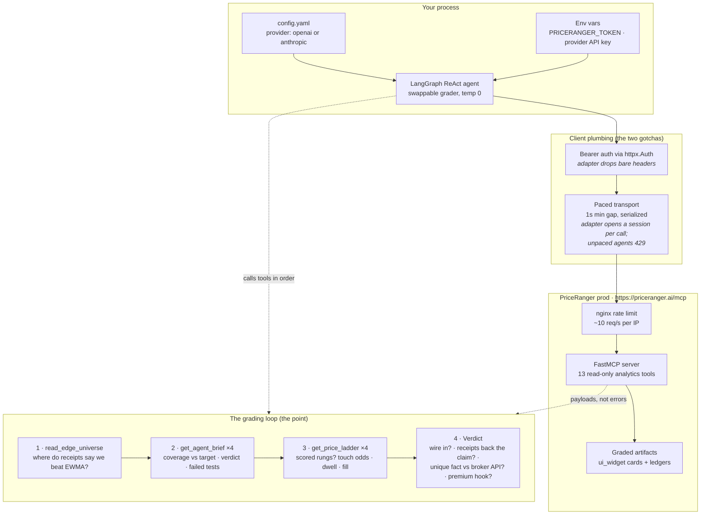

# PriceRanger MCP — Agent Value Check

An open example of how an agentic process qualifies the
[PriceRanger](https://priceranger.ai) MCP server: what it is, what it is not,
and how to grade it on evidence before wiring it into a trading agent.

**`priceranger_mcp_eval.py`** is the whole example. One file plus a small
`config.yaml`, no framework beyond LangGraph's prebuilt ReAct agent.

## What the service is (and is not)

**Risk telemetry with receipts.** Per asset, per hour:

- A calibrated range band that publishes its **realized coverage against the
  90% it promises**, a verdict, and the list of calibration tests it failed.
- A price ladder whose rungs carry **graded touch odds, dwell time, and fill
  probability** — measured against realized tape, not drawn.
- A routing surface (`edge_universe.json`) that says which assets beat a free
  EWMA baseline on forward receipts and which do not — *"use us where we win;
  elsewhere the free one is sharper."*

It is **not** a forecast that beats the market, and it does not describe itself
as one. What a broker API cannot give you is not the numbers — it is *the
evidence the numbers keep*.

The premium hook: a model lane is graded against the same persistence baseline
and only ships where the receipts say it wins — a subscriber inherits a sharper
band the moment it earns its place, with no integration change.

## How it works



## Setup

This is a **client** — you do not run an MCP server. Last run green on Python 3.12.

```bash
pip install -r requirements.txt
```

```bash
export PRICERANGER_TOKEN=<your minted token>   # signup at priceranger.ai — no anonymous tier
export OPENAI_API_KEY=<your key>
python priceranger_mcp_eval.py
```

### Choosing the grader

`config.yaml` picks which model does the grading. The tools, the questions and
the loop are identical either way — a service worth wiring in should survive
being graded by more than one model.

```yaml
provider: openai        # openai | anthropic

openai:
  model: gpt-4o
  temperature: 0
  api_key_env: OPENAI_API_KEY

anthropic:
  model: claude-sonnet-4-5
  temperature: 0
  api_key_env: ANTHROPIC_API_KEY
```

Only the selected provider is imported, so you need just the one installed —
drop the other from `requirements.txt` if you like. Export the matching key
(`ANTHROPIC_API_KEY` for `provider: anthropic`) and the run reports what it
resolved:

```
[grader: openai/gpt-4o temp=0 · config: /path/to/config.yaml]
```

Delete `config.yaml` and it falls back to the built-in OpenAI defaults, saying
so on that same line. Set the Anthropic `model` to something your key can
actually reach — a wrong ID fails on the first call, not at startup.

Optional overrides:

| Env var | Default | Purpose |
|---|---|---|
| `PRICERANGER_EVAL_CONFIG` | `config.yaml` beside the script | Use a different config file |
| `PRICERANGER_EDGE_UNIVERSE_URL` | `https://priceranger.ai/widgets/edge_universe.json` | Routing artifact over HTTPS |
| `PRICERANGER_EDGE_UNIVERSE_PATH` | unset | Read the routing artifact from a local file instead |

If the routing artifact is unreachable, the eval skips the routing step and
grades on receipts alone — it reports the gap instead of failing.

## What a run looks like

The agent reads the routing surface, opens graded receipts on the assets, then
checks the 1h-vs-4h horizon claim against the shadow-lane card — and answers
five questions without flattery. A real run against prod:

```
tools called: ['read_edge_universe',
               'get_agent_brief', 'get_agent_brief',
               'get_agent_brief', 'get_agent_brief',
               'get_price_ladder', 'get_price_ladder',
               'get_price_ladder', 'get_price_ladder',
               'get_shadow_frequency', 'get_shadow_frequency_asset']

1. WIRE IT IN?  YES — calibrated risk telemetry with forward-tested receipts.
2. RECEIPTS BACK THE CLAIM?  Yes — coverage, verdict, and failed-tests travel
   with the numbers; the service reports where it does not beat the baseline.
3. UNIQUE?  A calibrated hour-ahead band with measured coverage and graded
   touch odds — not available from a broker API or free feed.
4. PREMIUM HOOK:  Yes — a sharper band that earns its place with no integration
   change is a compelling reason to stay subscribed.
5. THE HORIZON SIGNAL:  Publishing an honest negative about the 1h lane
   alongside an unproven 4h positive raises confidence — it shows the service
   does not promote immature signals.
```

The verdict is the model's, reached from the service's own receipts — that is
the whole design. The example is a grader, not a brochure.

Two things a run can teach you that the verdict alone cannot:

- **Tool order is not guaranteed.** The agent reads the same evidence whether it
  pairs brief→ladder per asset or groups them (as above). Judge the verdict, not
  the call sequence.
- **A degraded read is the eval working.** If the routing artifact is
  unreachable, or a surface is not yet published, the agent says so instead of
  failing — and an earlier run correctly answered NO when the shadow tools were
  not yet advertised. A grader that can only say yes is not grading.

## Moving this to your own repo

Everything is self-contained: the one `.py` file, this README, `config.yaml`,
and `requirements.txt`. The only coupling to PriceRanger is the public MCP URL
and your token. Swap `MCP_URL` and the tool names and the same grading loop
works against any MCP server.
