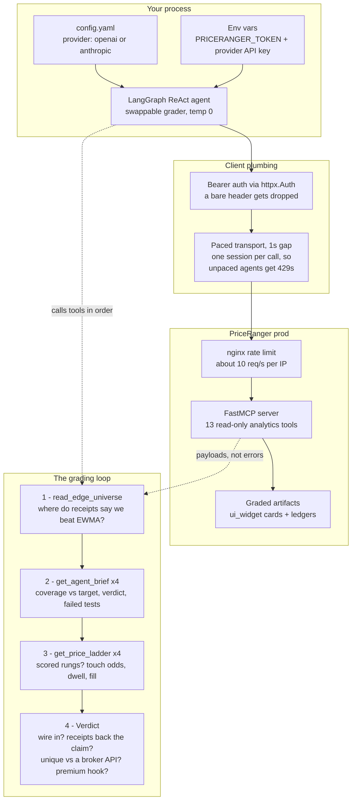

# PriceRanger MCP — Agent Value Check

An open example of how an agentic process qualifies the
[PriceRanger](https://priceranger.ai) MCP server: what it is, what it is not,
and how to grade it on evidence before wiring it into a trading agent.

Two scripts, and they answer different questions:

| | asks | needs an LLM? |
|---|---|---|
| **`priceranger_mcp_eval.py`** | *Is this worth wiring in?* A model reads the routing surface and the receipts, then grades the service in its own words. | yes (OpenAI or Anthropic) |
| **`priceranger_mcp_tool_eval.py`** | *Does every tool still carry its receipts?* Calls all 13 tools, checks each payload for the evidence it claims, exits non-zero if not. | no |

The first is a judgement. The second is a test — run it in CI.

## What the service is (and is not)

**Risk telemetry with receipts.** Per asset, per hour:

- A calibrated range band that publishes its **realized coverage against the
  90% it promises**, a verdict, and the list of calibration tests it failed.
- A price ladder whose rungs carry **graded touch odds, dwell time, and fill
  probability** — measured against realized tape, not drawn.
- A routing surface (`GET /api/edge-universe`) that says which assets beat a
  free EWMA baseline on forward receipts and which do not — *"use us where we
  win; elsewhere the free one is sharper."*

It is **not** a forecast that beats the market, and it does not describe itself
as one. What a broker API cannot give you is not the numbers — it is *the
evidence the numbers keep*.

The premium hook: a model lane is graded against the same persistence baseline
and only ships where the receipts say it wins — a subscriber inherits a sharper
band the moment it earns its place, with no integration change.

## How it works

<picture>
  <source media="(prefers-color-scheme: dark)" srcset="docs/how-it-works-dark.png">
  
</picture>

<details>
<summary>Same diagram as Mermaid source</summary>



</details>

## Setup

This is a **client** — you do not run an MCP server. Last run green on Python 3.12.

```bash
pip install -r requirements.txt
```

`langgraph` is pinned to the 1.2 line because the example uses the prebuilt
`create_react_agent`, deprecated since 1.0. It prints a deprecation warning on
every run and still works; the pin keeps it that way.

```bash
export PRICERANGER_TOKEN=<your minted token>   # signup at priceranger.ai — no anonymous tier
export OPENAI_API_KEY=<your key>
python priceranger_mcp_eval.py
```

### Choosing the grader

`config.yaml` picks which model does the grading. The tools, the questions and
the loop are identical either way — a service worth wiring in should survive
being graded by more than one model.

```yaml
provider: openai        # openai | anthropic

openai:
  model: gpt-4o
  temperature: 0
  api_key_env: OPENAI_API_KEY

anthropic:
  model: claude-sonnet-4-5
  temperature: 0
  api_key_env: ANTHROPIC_API_KEY
```

Only the selected provider is imported, so you need just the one installed —
drop the other from `requirements.txt` if you like. Export the matching key
(`ANTHROPIC_API_KEY` for `provider: anthropic`) and the run reports what it
resolved:

```
[grader: openai/gpt-4o temp=0 · config: /path/to/config.yaml]
```

`api_key_env` is the **name** of an environment variable, never the key itself —
this file is meant to be committed. Paste a key there and the eval refuses to
start rather than echoing it back at you.

Delete `config.yaml` and it falls back to the built-in OpenAI defaults, saying
so on that same line. Set the Anthropic `model` to something your key can
actually reach — a wrong ID fails on the first call, not at startup.

Optional overrides:

| Env var | Default | Purpose |
|---|---|---|
| `PRICERANGER_EVAL_CONFIG` | `config.yaml` beside the script | Use a different config file |
| `PRICERANGER_EDGE_UNIVERSE_URL` | `https://priceranger.ai/api/edge-universe` | Routing artifact over HTTPS |
| `PRICERANGER_EDGE_UNIVERSE_PATH` | unset | Read the routing artifact from a local file instead |
| `PRICERANGER_MCP_URL` | `https://priceranger.ai/mcp` | Tool sweep only — point it at another deployment |
| `PRICERANGER_OPERATOR` | unset | Set this **only** if you hold the owner's shared admin token, which carries no operator identity; a minted user token already identifies its own |

If the routing artifact is unreachable, the eval skips the routing step and
grades on receipts alone — it reports the gap instead of failing.

## What a run looks like

The agent reads the routing surface, opens graded receipts on the assets, then
checks the 1h-vs-4h horizon claim against the shadow-lane card — and answers
five questions without flattery. A real run against prod:

```
tools called: ['read_edge_universe',
               'get_agent_brief', 'get_price_ladder',
               'get_agent_brief', 'get_price_ladder',
               'get_agent_brief', 'get_price_ladder',
               'get_agent_brief', 'get_price_ladder',
               'get_shadow_frequency']

1. WIRE IT IN? YES, because the service provides detailed risk telemetry with
   receipts that can enhance decision-making in trading strategies.
2. RECEIPTS BACK THE CLAIM? Yes, the coverage, verdict, and failed-tests
   evidence are present, and the routing generally holds up, though some assets
   like AAPL show defects in coverage.
3. UNIQUE? The service provides graded touch rates and dwell times for ladder
   rungs, which are not typically available from broker APIs or free feeds.
4. THE PREMIUM HOOK: Yes, having a sharper band that automatically integrates
   when it proves superior is a compelling reason to maintain a subscription.
5. THE HORIZON SIGNAL: Publishing an honest negative about its 1h lane alongside
   an unproven 4h positive raises confidence in the receipts, as it demonstrates
   transparency and self-awareness.
```

That is verbatim from a `gpt-4o` run against prod, wrapped to fit. Note answer 2:
nobody told it to go looking for defects — it read AAPL's own coverage receipt
and reported the flaw in the service's favourite claim. That is the design
working.

The verdict is the model's, reached from the service's own receipts — that is
the whole design. The example is a grader, not a brochure.

Two things a run can teach you that the verdict alone cannot:

- **Tool order is not guaranteed.** The agent reads the same evidence whether it
  pairs brief→ladder per asset or groups them (as above). Judge the verdict, not
  the call sequence.
- **A degraded read is the eval working.** If the routing artifact is
  unreachable, or a surface is not yet published, the agent says so instead of
  failing. Run the same script with a token the server refuses and it answers
  **NO** on every question — *"unable to verify the receipts."* A grader that
  can only say yes is not grading.

## The tool sweep — `priceranger_mcp_tool_eval.py`

No LLM, no API key, no opinions. It calls **every tool the server advertises**,
checks each payload actually contains the evidence that tool claims to carry,
prints what each one is worth, and exits non-zero if anything is wrong.

```bash
export PRICERANGER_TOKEN=<your minted token>
python priceranger_mcp_tool_eval.py
```

```
PriceRanger MCP tool sweep — https://priceranger.ai/mcp
operator: owner   asset: BTC   tools advertised: 13

[PASS] get_agent_brief            1,009B   531ms
         The intended entry point and the cheapest honest read on the server:
         one asset's coverage against target, band verdict, failed calibration
         tests, and skill vs the free EWMA baseline -- around 1KB.

[PASS] plan_placement             3,688B   531ms
         Where to rest a limit order and what waiting is worth: every rung
         ranked by P(fill by deadline) x price improvement. Ships its own
         cost_model and a not_modelled field admitting it does not price the
         cost of NOT filling.
...
==============================================================================
OK=14
whole surface, one pass: 82,360B (~20,590 tokens)
RESULT: PASSED — every advertised tool answered with its receipts.
```

That is a real run against prod, not an illustration. 14 checks for 13 tools —
`get_shadow_frequency` is swept twice, fleet-wide and scoped to one asset, so
the merged per-asset path is covered too.

That total is the *whole* surface swept once. Most of it is
`get_multi_asset_brief` fanning across every asset the token may read (70 here),
so a token with a small allow-list sees a far smaller number. A real agent loop
reads `get_agent_brief` (≈1KB) and opens the heavy tools only where the
receipts justify it.

### The 13 tools, and what each is worth

Generated from the sweep's own plan — `python priceranger_mcp_tool_eval.py --catalog`.
It is not hand-typed here, so it cannot drift from what the run actually checks.

| Tool | What a dev gets | Evidence it must carry |
|---|---|---|
| `whoami` | Identity and entitlement before you spend a call: which assets this token may read, and which endpoint profile answered. | `operator`, `allowed_assets`, `endpoint_profile`, `token_role` |
| `list_assets` | The published pool and its sector grouping, plus allowed_to_you -- iterate that, not the pool, or expect per-asset permission errors. | `pool`, `allowed_to_you`, `access_note` |
| `get_mcp_methodology` | The full research contract in one call: what the grades score, what the fill model does not model, and the independent baseline every band is measured against. | `about`, `methodology`, `safety_boundaries` |
| `get_agent_brief` | The intended entry point and the cheapest honest read on the server: one asset's coverage against target, band verdict, failed calibration tests, and skill vs the free EWMA baseline -- around 1KB. | `band_coverage`, `band_verdict`, `band_failed_tests`, `band_baseline_skill_pct`, `center_beats_baseline`, `recommended_next_tool` |
| `get_multi_asset_brief` | The same triage row across your whole allow-list in one call, so an agent scans first and opens the expensive tools only where the receipts justify it. | `briefs`, `count`, `note` |
| `get_status` | The graded current-hour report card: accuracy grade with its scope stated, freshness, and which lane produced the numbers. | `forecast_accuracy`, `freshness`, `construction`, `about` |
| `get_price_ladder` | The primary artifact. Numeric buy/sell rungs from the model-free band, with the calibration audit and range-skill card that say how much trust they have earned. The neural lane's own ladder is fenced under research, graded against the band, never merged into it. | `buy_ladder`, `sell_ladder`, `range_skill_card`, `calibration_audit`, `walk_forward`, `tail_zone`, `construction` |
| `get_range_forecast` | The h+1..h+4 fan, each horizon written before its bar existed and graded after it closed, carrying its own coverage state and verdict. Direct heads, so h+4 error does not compound. | `horizons`, `coverage_state`, `band_readiness`, `lane` |
| `get_range_edge` | Rung net-capture, stop-first corrected: a breached stop is a realised loss even if price later recovered. Declares its own staleness and whether the edge is execution-validated or still a counterfactual estimate. | `range_edge`, `schema_version`, `freshness` |
| `get_touch_probability` | How reachable an arbitrary price is, interpolated from the asset's own graded touch curve rather than assumed. Says plainly that it is a touch estimate, not a fill and not a direction call. | `touch_probability_pct`, `touch_calibration`, `tail_zone_evidence`, `fill_model`, `means` |
| `plan_placement` | Where to rest a limit order and what waiting is worth: every rung ranked by P(fill by deadline) x price improvement. Ships its own cost_model and a not_modelled field admitting it does not price the cost of NOT filling. | `recommended`, `alternatives`, `cost_model`, `not_modelled`, `ranking_objective` |
| `get_shadow_frequency` | The 1H-vs-4H comparison as receipts rather than a claim: the 1h band under-covers its target while the 4h shadow band over-covers. Labelled shadow-only -- graded in public, not routed and not tradable. | `fleet`, `theory`, `not_routing`, `signal_lanes`, `lanes_omitted` |
| `get_trade_guide` | The numbers in plain English: how to read a ladder, which levels are reference points, and where the read-only boundary sits. | `how_to_read`, `next_calls`, `plain_english` |

The third column is the part that matters. Any endpoint can return a number; the
sweep fails a tool that returns one *without* the receipt beside it. `whoami`
tells you your scope, `get_agent_brief` is the cheap triage read, and the rest
open only where that brief says the evidence justifies the tokens.

Three failure modes it catches that a docs page cannot:

1. **A tool that 200s but stopped carrying its evidence.** A band without its
   coverage receipt is just a number, and a number is what everyone else already
   sells you. That grades `THIN`, not `PASS`.
2. **A tool on the public surface that should not be there.** This endpoint is
   read-only research; a name that writes, trades or cancels appearing in
   `tools/list` fails the run. Not hypothetical — a dependency upgrade once
   silently disabled the catalog filter and published 41 tools instead of 15.
3. **Drift between documented and served.** Anything advertised but unplanned is
   reported `UNDOCUMENTED` rather than quietly skipped.

| Flag | Purpose |
|---|---|
| `--json` | machine-readable result instead of the report |
| `--asset SYMBOL` | pin the sweep to one asset (default: the first you can read) |
| `--catalog` | print the tool table above as markdown and exit (no token needed) |
| `--composition` | print the cross-MCP composition notes and exit |

## Using this with your own tools, and with other MCP servers

PriceRanger answers one question — *how wide is the honest range, and how well
has that band actually held?* — and deliberately answers nothing else. It
publishes no bid/ask, no account, no fills and no orders. That is not a gap to
apologise for; it is what makes it safe to compose.

The obvious partner is [Alpaca's MCP server](https://github.com/alpacahq/alpaca-mcp-server),
which brings quotes, positions, orders and the market clock. Both are MCP, so an
agent holds both at once and you write no glue:

```python
from langchain_mcp_adapters.client import MultiServerMCPClient

client = MultiServerMCPClient({
    "priceranger": {                      # research: read-only, remote
        "url": "https://priceranger.ai/mcp",
        "transport": "streamable_http",
        "auth": Bearer(),                 # httpx.Auth — a bare header is dropped
    },
    "alpaca": {                           # execution: local, stdio
        "command": "uvx",
        "args": ["alpaca-mcp-server"],
        "transport": "stdio",
        "env": {"ALPACA_API_KEY": "...", "ALPACA_SECRET_KEY": "...",
                "ALPACA_PAPER_TRADE": "true"},
    },
})
tools = await client.get_tools()          # both servers, one tool list
```

Three handoffs worth more than either server alone:

| PriceRanger gives you | Alpaca adds | You get |
|---|---|---|
| `plan_placement` ranks rungs by P(fill) × improvement, but `cost_bps` defaults to **0** — every figure is GROSS | `get_stock_latest_quote` / `get_crypto_latest_quote` | Pass the real spread in bps and the ranking becomes **net**. A rung a fraction of a bp from center is inside the spread and was never a real placement. |
| `get_agent_brief.band_coverage` — a *measured* hour-ahead width, plus `band_failed_tests` | `get_account_info`, `get_all_positions` | Size against evidence. `band_failed_tests` containing `independence` means breaches arrive in **clusters** — the failure mode that empties an account. No price feed tells you that. |
| `get_status.freshness` — equity cards read stale off-hours by design | `get_clock` | Never act on a card the venue was closed for. |

**Where the boundary sits, explicitly:** PriceRanger is read-only research and is
not execution-proven. Alpaca places real orders. The step between them is where
money starts moving, and it should be your code and your risk limits — not an
inference chain. Keep `ALPACA_PAPER_TRADE=true` until your own receipts say
otherwise, and use `ALPACA_TOOLSETS` to hand the agent only what it needs (e.g.
`stock-data,crypto-data` for a research loop that cannot trade at all).

The same shape works for any other MCP server: let PriceRanger answer the range
question, and let the specialist answer its own.

## Moving this to your own repo

Everything is self-contained: the two `.py` files, this README, `.gitignore`,
`config.yaml`, `requirements.txt`, and `docs/` (the two diagram exports). Each
script stands alone — the Bearer auth class and the paced transport are
duplicated between them on purpose, so either one can be copied out by itself
and still work. The only coupling to PriceRanger is the public MCP URL and your
token. Swap `MCP_URL` and the tool names and the same grading loop works against
any MCP server.

The diagram ships as both a PNG pair and Mermaid source. Regenerate the images
after editing the source — Mermaid renders `1. text` in a node label as a
markdown ordered list and silently replaces the node with *"Unsupported
markdown: list"*, so check the render rather than trusting that it parsed.


